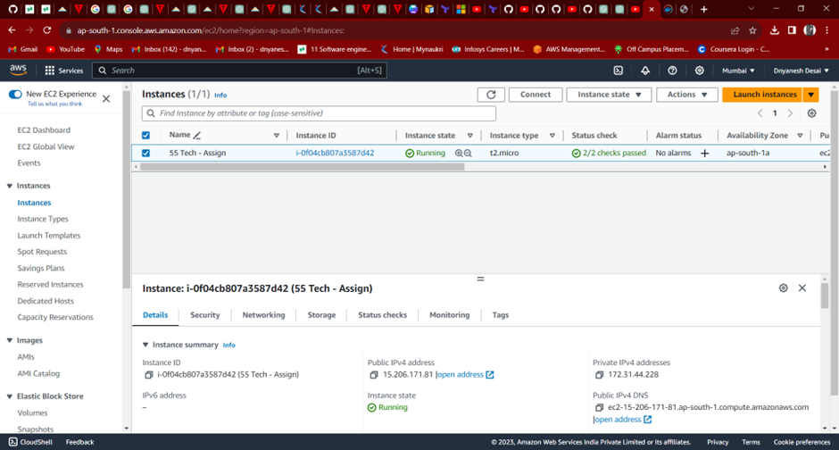
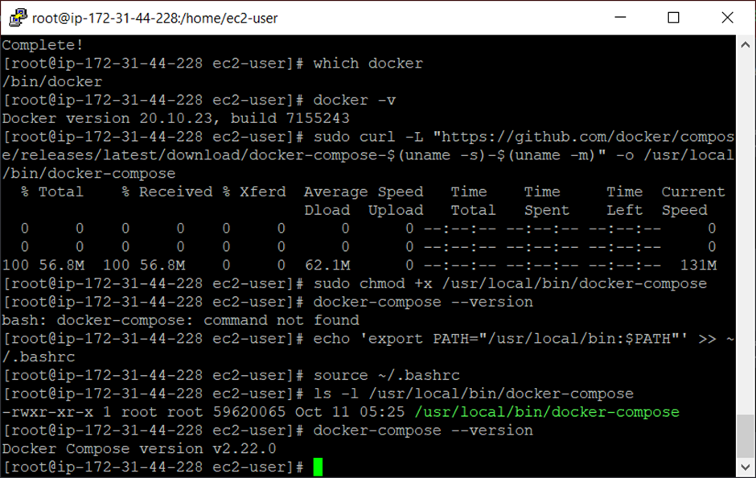
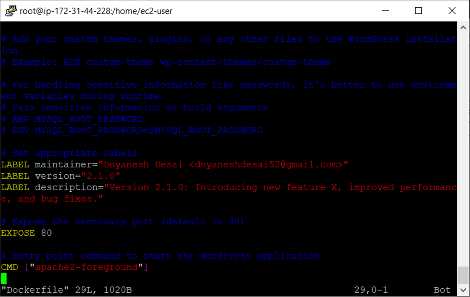
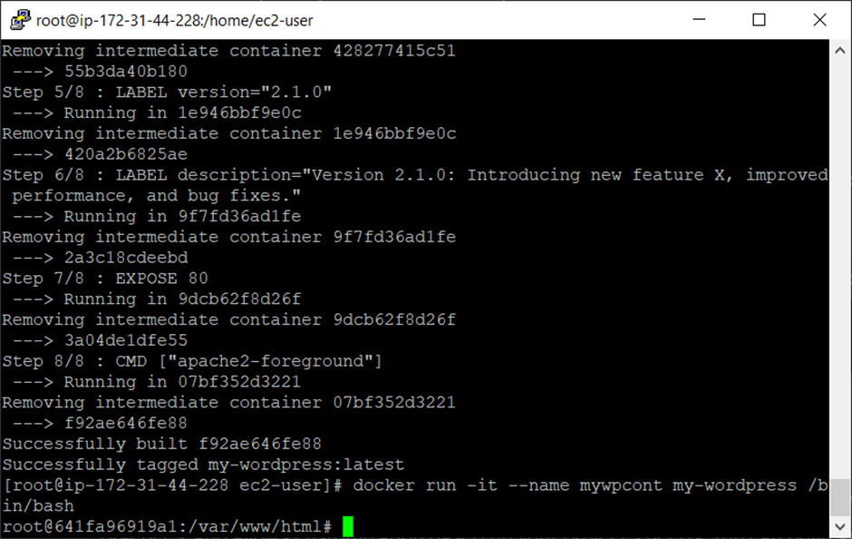
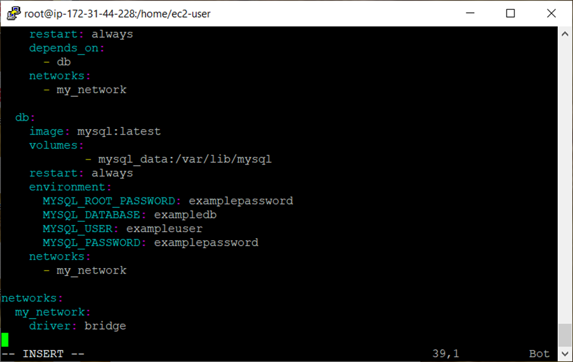
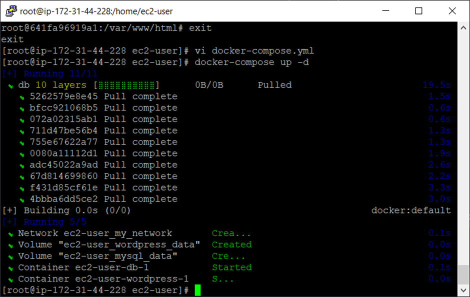
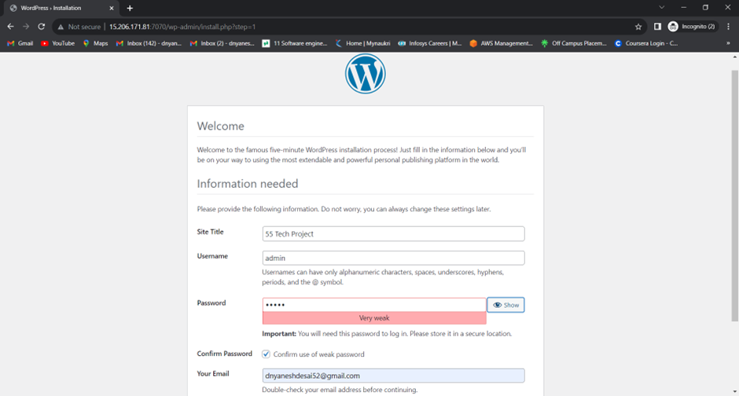
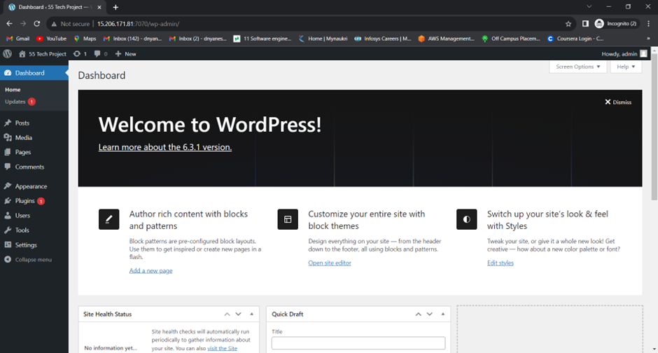
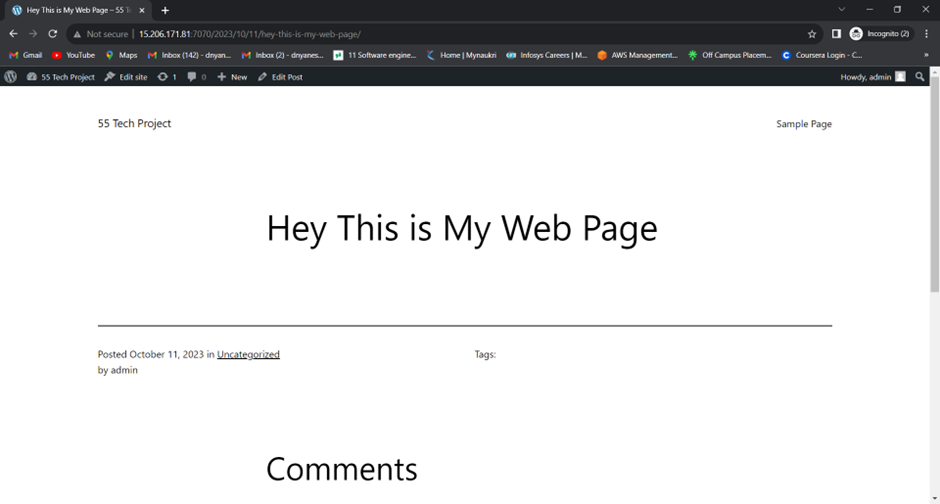

Dockerized WordPress with Optimized Database

This project demonstrates how to Dockerize a WordPress application and optimize its database for enhanced performance.

Approach
## A) Dockerfile: 
Utilize an official WordPress image as the base image. Minimize layers, use appropriate labels, and secure sensitive information.
WordPress is a popular content management system, and Docker provides an efficient and consistent way to deploy and manage applications. This project Dockerizes WordPress, making it easy to set up and run in various environments.

## Dockerfile Details

- **Base Image**: Official WordPress image
- **Working Directory**: `/var/www/html`
- **Exposed Port**: `80`
- **Entry Point**: `apache2-foreground`

This Dockerfile is used to create a Docker image for running WordPress. Let's break down each section:
1) So in 1st one is for Base Image i used the FROM Componet so this componet sets the official WordPress image as the base image. We're starting with the latest version of the official WordPress image from Docker Hub.
2) The 2nd componet which i used in dockerfile will be WORKDIR this componet sets the working directory to /var/www/html inside the container. It's where WordPress will be installed.
3) Then i used RUN componet genreally its used to execute the commands but in this part it removes the default themes and plugins that come with WordPress. It's optional and depends on your project requirements. You can keep or remove them based on your needs.
4) Adding Custom Themes, Plugins, or Files for that we can use ADD which can downloads the files, themes and plugins from internet.
# Example: ADD custom-theme wp-content/themes/custom-theme
5) For Handling Sensitive Information I used the ARG and ENV componets 
# ARG MYSQL_ROOT_PASSWORD
# ENV MYSQL_ROOT_PASSWORD=$MYSQL_ROOT_PASSWORD
Here, we're demonstrating how you can handle sensitive information like passwords. In a real-world scenario, you can use environment variables (e.g., $MYSQL_ROOT_PASSWORD) for more secure handling of sensitive data.
6) For setting Labels I can Use LABEL componet with the maintainer means who is the maintainer and maintainer name with mailid and versions just like 2.1.0 and description about the image and there vesion.
7) Then we need to expose the port For that I used EXPOSE componet so it will exposes port 80, the default port for serving web traffic, to allow incoming connections to the container.
8) The last one Componet is CMD it will execute the commands during runtime. so in this Dockerfile I used # CMD ["apache2-foreground"] This specifies the default command to run when the container starts. In this case, it's the apache2-foreground command to start the Apache web server for serving WordPress.
# This is all information related to Dockerfile
after writing the docker file we need to build the image for that I used:
 docker build -t my-wordpress .
This command builds docker images.
Then next run a container using the built image with this command:
 docker run -d -p 8080:80 --name mywpcont my-wordpress /bin/bash
This coomand create conatiner with port 80 followed by conatiner name mywpcont followed by image name.
This is all about Dockerfile and how it configures the WordPress environment within a Docker container.

## B) Docker Compose: 
Orchestrate the WordPress application using Docker Compose. Include services for WordPress and a MySQL database. Configure network settings, dependencies, and manage configuration securely through environment variables.
So we know docker compose are used manage or handle the multiple or many conatiners.
I this file I used version, then volumes for storing the data, inside the services I used wordpress and database serice, network.
# So Let's break down the provided Docker Compose file for WordPress and the database:
1) In 1st one I used docker compose version 
# version: '3.7'
It will specifies the version of the Docker Compose file format being used.
2) After version next I used is Volumes. So volumes is like a directory in which we can store a data. after the stoping or removing the conatiner the volumes are present it will not removed. Thats why I used Volumes in this file.
# volumes:
    wordpress_data:
    mysql_data:
Here, we define two volumes: wordpress_data and mysql_data. Volumes are used to persist data outside of the containers.
3) Next one is wordpress service inside I used following services:
- image: Specifies the official WordPress image.
- volumes: Mounts the wordpress_data volume to /var/www/html, allowing WordPress data to persist.
- environment: Sets environment variables for the WordPress service, including database connection details.
- ports: Maps port 80 in the container to port 7070 on the host.
- restart: Ensures the service restarts always.
- depends_on: Specifies that this service depends on the db service.
- networks: Connects to the my_network network.
4) Ater the wordpress service next one is database service:
- image: Specifies the official MySQL image.
- volumes: Mounts the mysql_data volume to /var/lib/mysql, allowing MySQL data to persist.
- restart: Ensures the service restarts always.
- environment: Sets environment variables for the MySQL service, including database credentials. Like name, password, username, root password for database
- networks: Connects to the my_network network.
# networks:
   my_network:
    driver: bridge
Defines a custom network named my_network with the bridge driver.
After that Run the services Open a terminal, navigate to the directory where docker-compose.yml is located, and run the following command:
 docker-compose up -d
Running the docker-compose up command launches the application in Docker containers.
You can access the WordPress application at http://localhost:7070 and configure it using the provided environment variables.

## C) Database Optimization: 
Enhance database performance through indexing, caching, and query optimization. Configure appropriate settings for InnoDB buffer pool size and disk I/O.

For optimization of data I used indexes, caching and quaery optimzation. For that i have created init.sql file and inside that I used indexes, caching and quaery optimzation then i have use this file in docker-compose file.Reason behind that we can easily understand the code also maintain the code.
In this section, the steps taken to optimize the database is as follows:
1) Indexing:
   To improve data retrieval speed, we created an index named 'index_name' on 'table_name' for columns 'column1', 'column2', and so on.
    # CREATE INDEX index_name ON table_name (column1, column2, ...);
2) Caching:
    We enabled MySQL's query cache and set the cache size to 256 MB (268435456 bytes) to cache SELECT query results.
    # SET GLOBAL query_cache_size = 268435456; -- Set cache size (in bytes)
    # SET GLOBAL query_cache_type = 1; -- Enable the query cache
3) Database Configuration Optimization:
    We optimized database configuration parameters for optimal performance, such as adjusting the InnoDB buffer pool size.
    SET GLOBAL innodb_buffer_pool_size = 5368709120; -- Set buffer pool size (in bytes)
4) Handling Sensitive Information:
   Use of Environment Variables: For sensitive information, such as passwords, it's better to use environment variables during runtime to avoid exposing them directly in the code or Dockerfiles.
   Passing Sensitive Information: We pass sensitive information, like the MySQL root password, as build arguments and then set them as environment variables. 
   # Pass sensitive information as build arguments
     ARG MYSQL_ROOT_PASSWORD

   # Set MySQL root password as environment variable
   ENV MYSQL_ROOT_PASSWORD=$MYSQL_ROOT_PASSWORD

## Additional Notes:-
I have attached a screen shot of this assignments:
1) Firstly you need to login into your aws account if have. otherwise you can install docker for your windows or mackos. if you are using linux the you can install both docker and docker compose.

2) Install Docker and Docker Compose:

3) Write a dockerfile and build image and create container:

4) Creating a docker-compose.yml file for wordpress and database:

5) Running the docker-compose up command launches the application in Docker containers.
You can access the WordPress application at http://localhost:7070 and configure it using the provided environment variables.

The docker-compose.yml file defines the services, networks, and volumes needed for the application.

## Recommendations
Regularly backup your database to prevent data loss.
Monitor resource usage to optimize performance further.

## Challenges
Initial setup and configuration might require some experimentation, especially if new to Docker and WordPress.
Some error are occures in installing docker compose it will installed but not showing version the we need to modify some things in it. some error will occures in Dockerfile and Docker-compose.yml sovled by self.

Thank You!!!

